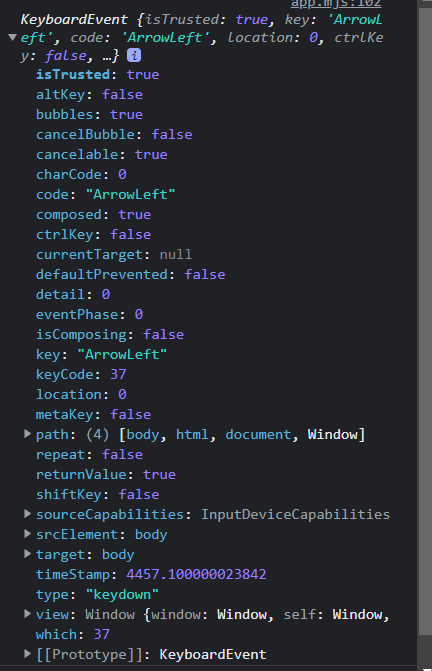

## keydown

keydown 이벤트는 **키보드가 눌릴 때 발생하는 이벤트**이다.
keypress 이벤트와 달리 keydown이벤트는 모든 키에 이벤트가 발생한다.

```js
window.addEventListener("keydown", (event) => {
  if (event.key === "Escape") {
  }
});
```

**이벤트핸들러**

```js
target.onkeydown = function (event) {};
```

**interface**  
KeyboardEvent

## 키보드 이벤트 프로퍼티 및 메서드



**event.keyCode 프로퍼티는 deprecated** 되었으니 특정 키코드를 참조하고 싶다면 **event.code나 event.key**를 사용하자.

**예시**

```js
window.addEventListener("keydown", (e) => {
  console.log(e);
  if (e.key === "Escape") {
    modal.classList.remove("open-modal");
  }
});
```

## Reference

- https://developer.mozilla.org/en-US/docs/Web/API/Document/keydown_event
